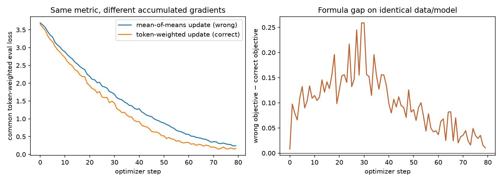
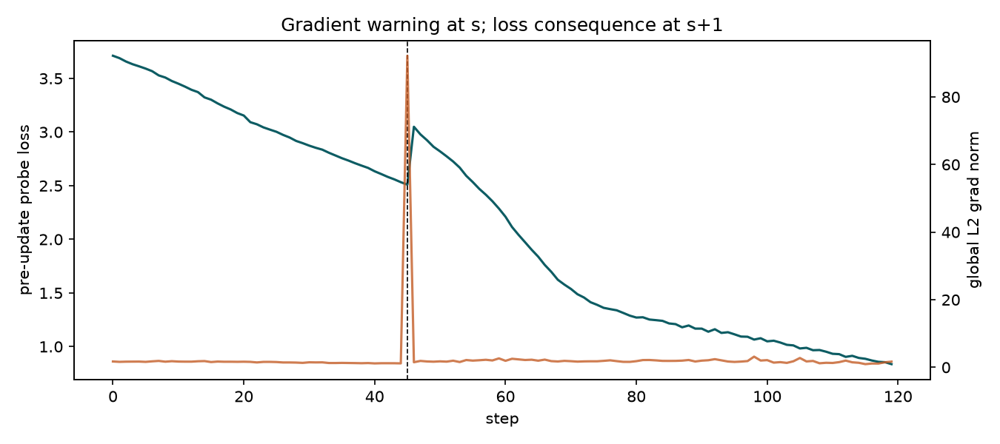

# Session X — Make the training loop tell the truth

This submission uses a two-layer causal Transformer and real optimizer steps. The notebook is already executed, so every result can be reviewed without rerunning it.

## Run it

```bash
cd Session-X
pip install -r requirements.txt
python run_session_x.py
```

Main files:

- `Session_X_Training_Truth.ipynb` — executed assignment notebook
- `truth_loop.py` — model and experiment implementations
- `run_session_x.py` — reproducible CLI run
- `artifacts/results.json` — machine-readable measured results
- `figures/accum_gap.png` and `figures/grad_norm_vs_loss.png` — generated plots

## 1. Every tensor shape

Notation: `B` is batch examples, `T` token positions, `C` embedding channels, `H` attention heads, `D=C/H` channels per head, and `V` vocabulary size.

The shape trace reports **103 tensors** from a complete forward/backward step. It includes every trainable parameter; inputs and positions; embeddings; both blocks' layer norms; packed and split Q/K/V; head views; attention scores, masks, probabilities, and contexts; MLP expansion/activation/projection; residuals; logits; shifted and flattened cross-entropy inputs; per-token losses; scalar loss; and every parameter gradient.

Representative shapes:

- `tokens (2,24)` means `B × T`.
- `token_embeddings (2,24,64)` means `B × T × C`.
- `qkv (2,24,192)` means `B × T × 3C`.
- `q_heads (2,2,24,32)` means `B × H × T × D`.
- `scores (2,2,24,24)` means `B × H × query-position × key-position`.
- `logits (2,24,50)` means `B × T × V`.
- `shift_logits (2,23,50)` and `shift_labels (2,23)` align predictions with the next tokens.
- `token_nll (46,)` is one loss for each of `B(T−1)=46` valid targets.
- `loss ()` is a scalar.
- Each `grad.<parameter>` has the same shape as its parameter.

The notebook output contains the complete line-by-line trace.

## 2. One gradient checked by hand

I checked the real parameter `blocks.0.mlp.0.weight[0,0]` in FP64. With `ε=0.001`:

```text
w                  = 0.036201652139
L(w + ε)           = 3.479381625957
L(w - ε)           = 3.479399030455
(L+ - L-) / (2ε)   = -0.008702248968
backward()          = -0.008702265595
absolute error      = 1.663e-08
relative error      = 1.911e-06
```

The two derivatives agree to several decimals. Central difference and FP64 were used to reduce truncation and cancellation error. The check confirms that the implemented next-token shift, mean reduction, and backward graph are mutually consistent.

## 3. Gradient accumulation broken on purpose

The four microbatches have lengths `[16,16,48,48]`, hence valid next-token counts `[15,15,47,47]`.

The broken objective is the average of microbatch means:

```text
L_wrong = (mean_1 + mean_2 + mean_3 + mean_4) / 4
```

It gives every microbatch 25% weight. The correct objective is:

```text
L_right = sum(all token losses) / sum(valid token counts)
```

Its weights are `[12.1%,12.1%,37.9%,37.9%]`. Short examples use a `+1` token pattern and long examples use a `−1` pattern so the weighting error is visible, not hidden by identical distributions.

Both cloned models are evaluated using the **same token-weighted metric**:

- Final loss after broken updates: **0.2445**
- Final loss after correct updates: **0.1635**
- Mean wrong-objective minus correct-objective gap on identical model/data: **0.1001**

Both paths perform true accumulation: each microbatch calls `backward()` while gradients remain in `.grad`, followed by exactly one `optimizer.step()`. Only the per-microbatch scaling differs.



## 4. Grad norm moved before loss

Global L2 gradient norm is logged at every step. Probe loss is measured **before** each optimizer update.

At step 45 I deliberately simulate a loss-scaling bug: multiply only the backward objective by 80 and disable clipping for that update. This is a disclosed controlled intervention; it isolates the timing instead of pretending the event occurred naturally.

```text
                         step 44   step 45   step 46
global grad norm          1.1648    92.1840     —
pre-update probe loss     2.5328     2.5099   3.0494
```

The gradient norm warns at step `s=45`. Because loss at step 45 was measured before the update, the damage first appears in loss at `s+1=46`. This is the requested example where the gradient signal moves before the loss signal.



## 5. Honest MFU

The FLOP estimate includes parameter operations and sequence-dependent attention:

```text
F ≈ tokens × (6N + 12 × layers × width × sequence_length)
MFU = achieved model FLOP/s / nominal hardware peak FLOP/s
```

This is a CPU-only VM exposing two physical Intel Xeon Platinum 8259CL cores at 2.5 GHz. The nominal FP32 ceiling is:

```text
2 cores × 2 AVX-512 FMA units × 16 FP32 lanes × 2 FLOP/FMA × 2.5 GHz
= 0.320 TFLOP/s
```

Measured run:

- Unique parameters: **815,872**
- Tokens: **10,080**
- Wall time: **0.615 s**
- Estimated model work: **53.31 GFLOP**
- Achieved: **0.0867 TFLOP/s**
- MFU proxy: **27.10%**

This is explicitly a **CPU MFU proxy**, not an H100 ratio. The distance to 40% is plausibly due to tiny matrices that cannot sustain SIMD peak, eager Python and many small operators, unfused attention and cross entropy, Adam's memory traffic, and VM scheduling. The nominal frequency may also drop under AVX-512, and the FLOP model is approximate; both are honest error bars.

## 6. `0.1` in FP32, BF16, and FP8 E4M3

Binary `0.1 = 1.100110011… × 2^-4`; `1001` repeats forever. Every finite format therefore rounds it. These encodings use round-to-nearest-even.

```text
FP32  = 0 | 01111011 | 10011001100110011001101
      = 00111101110011001100110011001101 = 0x3DCCCCCD
      ≈ 0.100000001490

BF16  = 0 | 01111011 | 1001101
      = 0011110111001101 = 0x3DCD
      ≈ 0.100097656250

E4M3  = 0 | 0011 | 101
      = 00011101 = 0x1D
      ≈ 0.101562500000  (1.5625% relative error)
```

The unbiased exponent is `−4`. It is stored as `123 = 01111011` with bias 127 in FP32/BF16, and as `3 = 0011` with bias 7 in E4M3.

I would train matrix multiplications in **BF16**, while keeping FP32 master weights and optimizer state. BF16 retains FP32's exponent range while halving storage and bandwidth. Raw E4M3 is not my default: it needs dynamic scaling and FP8-aware kernels, and its percent-level error on `0.1` shows the precision cost directly.

## Reproducibility note

Random seeds are fixed. Training curves and gradient checks are deterministic on this setup. MFU changes slightly between runs because it uses wall-clock timing; `artifacts/results.json` records the exact checked-in measurement.
