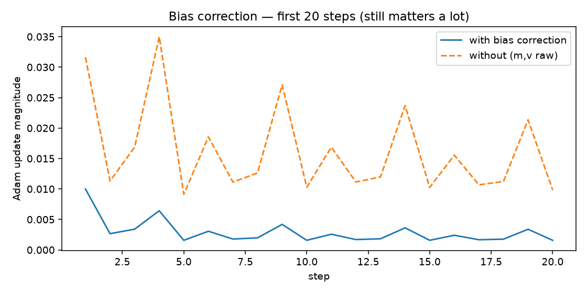
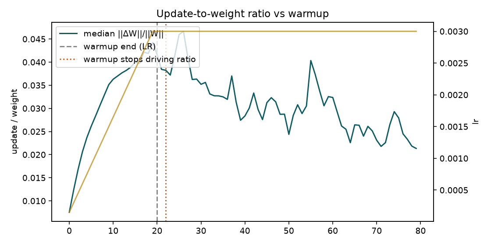
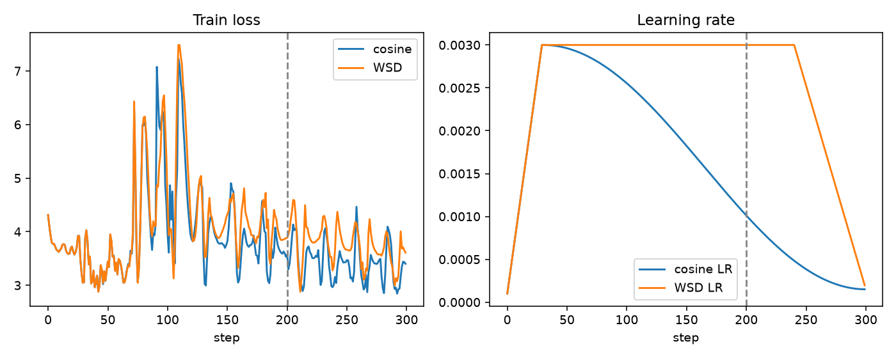
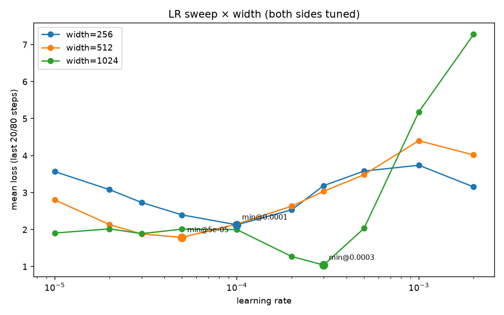

# Session XI — Optimizers, Adam by hand, schedules, and LR × width

Hands-on lab from the Session-XI lecture: reproduce Adam, see bias correction fade, watch warmup through update/weight ratios, compare cosine vs WSD mid-run, and sweep learning rate across widths before guessing η at 4096.

**Class reminder (assignment + lecture):** tune **both** sides before any optimizer/schedule claim. Almost every failed replication was a well-tuned method measured against a badly tuned one.

## How to run

```bash
cd Session-XI
python run_session_xi.py
```

Outputs:

| Path | Contents |
|------|----------|
| `artifacts/results.json` | All numeric results |
| `figures/bias_correction.png` | First 20 Adam steps ± bias correction |
| `figures/update_ratio_warmup.png` | `‖ΔW‖ / ‖W‖` vs warmup |
| `figures/cosine_vs_wsd.png` | Loss + LR for cosine vs WSD |
| `figures/lr_sweep_width.png` | Loss vs LR at widths 256 / 512 / 1024 |

Support code: `adam_lab.py` (math + tiny LM + schedules + sweeps), `run_session_xi.py` (driver).

Hyperparameters used unless noted: Adam/AdamW β₁ = 0.9, β₂ = 0.999, ε = 1e-8.

---

## 1. Reproduce Adam by hand

One scalar weight `w0 = 0.5`, five gradients, learning rate `η = 1e-3`:

```text
g ∈ {1.0, -0.5, 0.25, 2.0, -1.5}
```

Update (with bias correction):

```text
m_t     = β1 * m_{t-1} + (1 - β1) * g_t
v_t     = β2 * v_{t-1} + (1 - β2) * g_t²

m̂_t     = m_t / (1 - β1^t)
v̂_t     = v_t / (1 - β2^t)

step_t  = η * m̂_t / (√v̂_t + ε)
w_t     = w_{t-1} - step_t
```

### Hand table (matches `torch.optim.Adam` in float64)

| t | g | m | v | m̂ | v̂ | step | w |
|---|---|---|---|---|---|------|---|
| 1 | 1.00 | 0.10000000 | 0.00100000 | 1.00000000 | 1.00000000 | 0.00100000 | 0.49900000 |
| 2 | −0.50 | 0.04000000 | 0.00124900 | 0.21052632 | 0.62481241 | 0.00026634 | 0.49873366 |
| 3 | 0.25 | 0.06100000 | 0.00131025 | 0.22509225 | 0.43718737 | 0.00034043 | 0.49839323 |
| 4 | 2.00 | 0.25490000 | 0.00530894 | 0.74120384 | 1.32922770 | 0.00064289 | 0.49775034 |
| 5 | −1.50 | 0.07941000 | 0.00755363 | 0.19391468 | 1.51375084 | 0.00015761 | 0.49759273 |

**Max |hand − PyTorch|** over `m`, `v`, `m̂`, `v̂`, `step`, `w`: **0** (exact agreement to float64).

Adam here is momentum (direction memory in `m`) plus adaptive scale (RMS in `v`) — the “GPS + speedometer” picture from class.

---

## 2. Disable bias correction — first 20 steps

Same five gradients cycled; η = 1e−2 so early steps are visible.



Without `m̂` / `v̂`, early `v` is tiny → `√v` blows up the step. With correction, step 1 is exactly `η` for `g = 1` (classic Adam warm-start).

| | |
|--|--|
| Relative \|Δstep\| at **t = 20** (cycling grads) | **~5.2×** — still huge |
| β₁ bias ~99% gone | t ≈ 44 |
| β₂ bias ~99% gone | t ≈ 4603 |
| Steps until rel \|Δstep\| stays &lt; 1% (const `g = 1`) | **3925** |

**Verdict:** within the assigned 20-step window the difference **does not** stop mattering. It stops mattering on the **β₂ timescale** — thousands of steps for β₂ = 0.999 — not on the plot window. Bias correction is an early-training fix; `v`’s correction is the long pole.

---

## 3. Update-to-weight ratio and warmup

For every named parameter, each step:

```text
r = ‖ΔW‖₂ / ‖W‖₂
```

Tiny LM (d = 64, 2 layers), linear warmup **20** steps to η = 3e−3, then hold.



Median ratio **rises with LR during warmup** (~7.5e−3 → ~4.4e−2 by step 19), then **stops being driven by warmup** once LR plateaus.

| | |
|--|--|
| Scheduled warmup | 20 |
| Step where warmup **stops changing** the ratio | **22** (first post-warmup step where median \|Δr\| falls back to typical mid-warmup churn) |

Per-layer snapshot at that step (sample):

| Parameter | `‖ΔW‖ / ‖W‖` |
|-----------|--------------|
| `tok_emb.weight` | 4.89e−2 |
| `pos_emb.weight` | 2.87e−2 |
| `blocks.0.qkv.weight` | 3.82e−2 |
| `blocks.0.proj.weight` | 3.59e−2 |
| `blocks.0.ln1.weight` | 7.94e−4 |

(Mean ratio at step 0 can explode if a tensor norm is near zero — use **median** / per-layer logs.)

---

## 4. Cosine vs WSD — 300 steps, report at 200

Same TinyLM (d = 128), same seed, patterned next-token data, AdamW, η_max = 3e−3, warmup = 30.

- **Cosine:** warmup → cosine anneal to 5% of η_max over 300 steps.
- **WSD:** warmup → **stable** η_max until step **240** (80% of run) → linear decay.



| Schedule | Loss @200 | Mean last-10 @200 | Loss @300 | Mean last-10 @300 |
|----------|-----------|-------------------|-----------|-------------------|
| Cosine | 3.5318 | **3.7020** | 3.4010 | **3.1374** |
| WSD | 3.8764 | 3.9717 | 3.6114 | 3.4587 |

**Checkpoint I would keep at step 200: cosine.**

Why: at 200, WSD is still in the high-LR stable phase (decay has not started). Cosine has already annealed and shows lower recent loss. That matches the lecture emotion: WSD’s rewards show up **after** the sharp drop, but mid-run it feels (and here looks) worse. For a final model I’d wait through WSD’s decay — and only trust the comparison after both schedules are tuned (same peak LR, warmup, token budget).

---

## 5. LR sweep × width (and a guess for 4096)

Same architecture family, widths **256 / 512 / 1024**, identical steps (100), warmup (10), clip, seed, and patterned data. Sweep η on a log grid — **both sides tuned**.



### Three minima (marked on the plot)

| Width | Best η | Mean loss (last 20/100) |
|-------|--------|-------------------------|
| 256 | **1e-4** | 2.130 |
| 512 | **5e-5** | 1.789 |
| 1024 | **3e-4** | 1.042 |

256→512 looks roughly **1/width** (1e−4 → 5e−5). 1024’s minimum jumps **up**, not down — the “haywire” curve class warned about when μP transfer is **not** on.

### What I would use at width 4096

| Transfer rule | η(4096) |
|---------------|---------|
| Log-log least-squares fit of the three η* | ~6e-4 |
| 1/width from 1024 | ~7.5e-5 |
| μP-style “reuse proxy η*” from 1024 | 3e-4 |

**Choice I would actually start with: ~5e-5 to 1e-4**, with a short re-sweep — not the raw fit.

**Confidence: low.** Reasons:

1. Only three widths; 1024’s η* broke the 1/width trend.
2. Toy patterned CE + short runs → minima are noisy (though seed 1 agreed on the same three grid points).
3. We did **not** enable μP parametrization; lecture point is that **with** μP the LR axis transfers, without it you cannot trust width→η.

So: treat 4096 as “start near the 512 optimum (~5e−5) and sweep a factor of ~3 either side,” not as a published hyperparameter.

---

## Files

```text
Session-XI/
  adam_lab.py           # Adam hand math, TinyLM, schedules, sweeps
  run_session_xi.py     # End-to-end runner
  artifacts/results.json
  figures/*.png
  transcript.txt        # class transcript (reference)
  README.md             # this file
```

## Takeaways

1. Hand Adam = PyTorch Adam when bias correction and dtypes match.
2. Bias correction is essential early; it stops mattering on the **β₂** clock (~10³ steps), not by step 20.
3. Warmup’s fingerprint is a rising `‖ΔW‖ / ‖W‖`; once LR plateaus, warmup stops driving that ratio (~step 20–22 here).
4. Mid-run (step 200) cosine looked better; WSD’s bet is the late drop — guts required.
5. Width→LR without μP is unreliable; tune every width before comparing anything.
