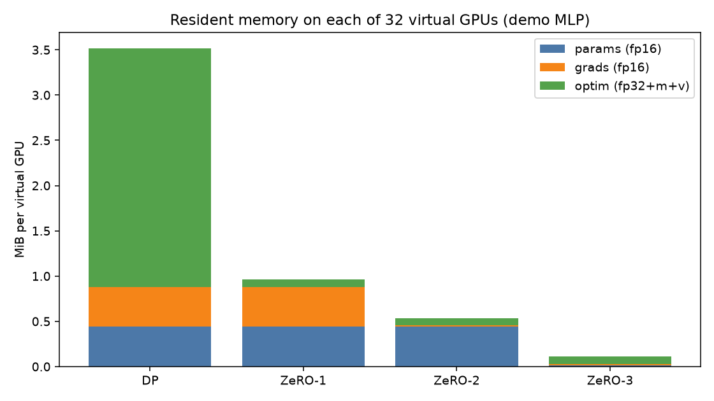
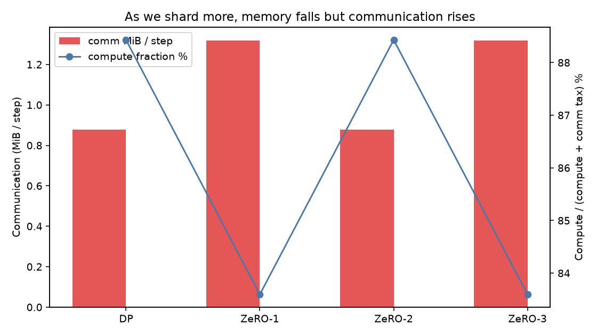
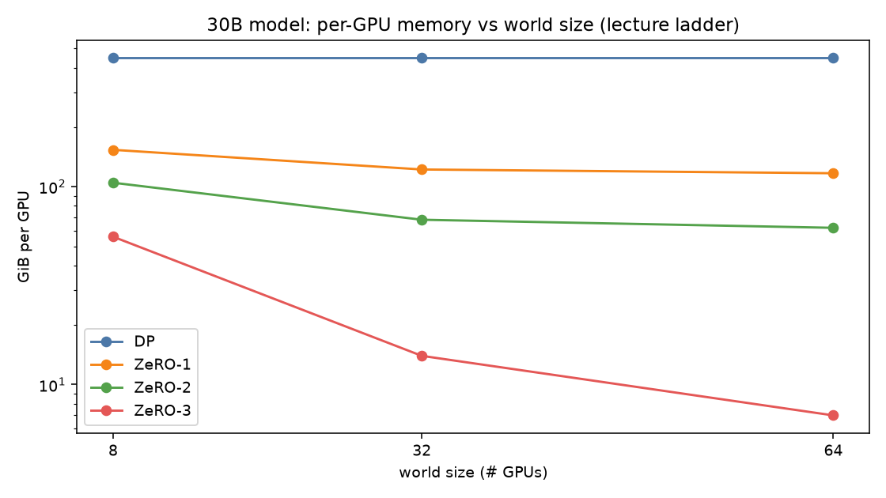
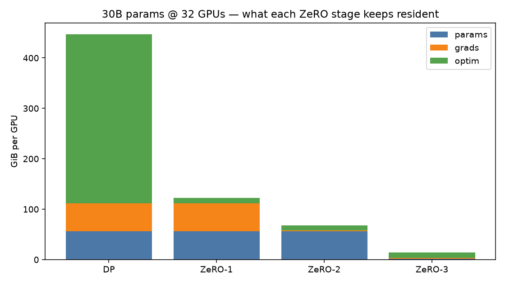

# Session XII — ZeRO on 32 Virtual GPUs

I built this lab to make the Session-XII lecture *concrete*: not “ZeRO saves memory,” but **exactly which bytes leave each GPU at stage 1, 2, and 3**, and what that costs in communication.

> Assignment: create 32 virtual GPUs, run a demo model on them, simulate ZeRO-1 / ZeRO-2 / ZeRO-3, and show how memory and computation change.

---

## What I understood (in my words)

### The real problem

A 30B-parameter model is not “30B floats.” Under BF16 training with Adam, each parameter roughly needs **16 bytes on every GPU** in plain data parallel:

| Piece | Bytes | Why it exists |
|-------|------:|---------------|
| fp16 weights | 2 | fast matmuls |
| fp16 gradients | 2 | backward |
| fp32 master + Adam `m` + Adam `v` | 12 | accurate updates (optimizer state) |

So 30B × 16 B ≈ **447 GiB per GPU** before you even argue about activations. An 80 GB card cannot hold a full DP copy. That is why ZeRO exists.

### Data parallel vs ZeRO

In **data parallel (DP / ZeRO-0)** every GPU holds a full identical copy of params, grads, and optimizer. More GPUs buy more throughput (different micro-batches), **not** less memory per GPU. The lecture table stays at 447 GiB/GPU for 8, 32, or 64 GPUs.

**ZeRO (Zero Redundancy Optimizer)** keeps the *data-parallel* training loop, but **shards the redundant state** so each rank owns only `1/N` of something:

| Stage | What is sharded | What each GPU still keeps full |
|-------|-----------------|--------------------------------|
| **ZeRO-1** | optimizer (12 B/param) | params + grads |
| **ZeRO-2** | optimizer + grads | params |
| **ZeRO-3** | optimizer + grads + **params** | nothing full in steady state |

I checked the closed-form math against the lecture ladder for 30B @ 8 GPUs:

| Stage | Lecture (≈) | This repo |
|-------|------------:|----------:|
| DP | 447 GiB | **447.0 GiB** |
| ZeRO-1 | 153 GiB | **153.7 GiB** |
| ZeRO-2 | (between 1 and 3) | **104.8 GiB** |
| ZeRO-3 | 55 GiB | **55.9 GiB** |

At 64 GPUs, ZeRO-1 ≈ **117 GiB** and ZeRO-3 ≈ **7 GiB** — same story the class showed: *more GPUs only help if you are sharding*.

### Memory falls, communication rises

That is the trade I care about:

- **DP**: all-reduce gradients (~2Ψ bytes of fp16 traffic). Lowest collective complexity relative to ZeRO-3; fattest memory.
- **ZeRO-1**: after the optimizer updates its shard, updated weights must be shared again → extra param traffic.
- **ZeRO-2**: reduce-scatter grads (each rank keeps only its shard) + gather params after the update.
- **ZeRO-3**: before forward (and again around backward) you **all-gather** parameters so the layer can compute, then throw them away and keep only your shard. Highest communication; lowest steady-state memory.

So “ZeRO-3 is always better” is false. If a step finishes in ~1 s and cross-node fabric costs ~2.4 s, you are buying memory you may not need at a painful latency tax. The lecture’s Excel-sheet mindset is the point: pick stage from **model size × GPU count × interconnect**, not from a blog title.

DeepSpeed / FSDP are the production implementations of this idea (config JSON for ZeRO stage, overlap, bucket size). This repo is the mental model underneath those configs.

---

## What I built

| File | Role |
|------|------|
| `zero_sim.py` | 32-thread virtual GPUs, demo MLP, ZeRO memory/comm accounting, step simulation |
| `run_session_xii.py` | CLI that runs all stages, prints the 30B ladder, writes figures + JSON |
| `Session_XII_ZeRO_Virtual_GPUs.ipynb` | Interactive notebook (submit this) |
| `figures/*.png` | Memory stacks + comm vs compute + 30B scaling |
| `artifacts/results.json` | Numbers from the last run |

### Virtual GPUs

`WORLD_SIZE = 32` threads via `ThreadPoolExecutor`. Each rank:

1. Builds the same `DemoMLP` architecture.
2. Draws its own micro-batch (data parallel).
3. Runs forward + backward (real PyTorch compute).
4. Participates in a barrier that averages gradients (stand-in for all-reduce / reduce-scatter).
5. Applies an Adam-like update **only on its parameter shard**.
6. Reports resident bytes from the ZeRO accounting formulas.

This is runnable on a laptop CPU or Colab; you do not need 32 physical GPUs to *see* the memory math.

### Demo results (32 virtual GPUs, ~230k-param MLP)

| Stage | Per-GPU resident | Comm / step | Compute fraction* |
|-------|-----------------:|------------:|------------------:|
| DP | 3.52 MiB | 900 KiB | ~88% |
| ZeRO-1 | 985 KiB | 1.32 MiB | ~84% |
| ZeRO-2 | 549 KiB | 900 KiB | ~88% |
| ZeRO-3 | 113 KiB | 1.32 MiB | ~84% |

\\*Compute fraction = FLOPs / (FLOPs + communication tax). Toy bandwidth tax, but the **direction** matches production: deeper ZeRO → more collective work relative to local matmuls on a small model.

### 30B @ 32 GPUs (the scale that matters)

| Stage | Per-GPU | Cluster total |
|-------|--------:|--------------:|
| DP | 447 GiB | 14.3 TiB |
| ZeRO-1 | 122 GiB | 3.9 TiB |
| ZeRO-2 | 68 GiB | 2.2 TiB |
| ZeRO-3 | **14 GiB** | 447 GiB |

DP never fits an 80 GB card. ZeRO-3 does — if you accept all-gather traffic.









---

## How to run

```bash
cd Session-XII
pip install torch matplotlib jupyter   # if needed
python run_session_xii.py
jupyter notebook Session_XII_ZeRO_Virtual_GPUs.ipynb
```

Or open the notebook in Colab, upload this folder, and run all cells.

---

## Formulas I used (readable)

Per-GPU residency for Ψ parameters and N GPUs:

```text
DP:      16Ψ
ZeRO-1:  4Ψ + 12Ψ/N          # full params+grads, shard optim
ZeRO-2:  2Ψ + 14Ψ/N          # full params, shard grads+optim
ZeRO-3:  16Ψ/N               # shard everything
```

Communication volume per step (order-of-magnitude, fp16 bytes):

```text
DP:      ~2Ψ                 # all-reduce grads
ZeRO-1:  ~2Ψ + Ψ             # all-reduce grads + share updated params
ZeRO-2:  ~Ψ  + Ψ             # reduce-scatter grads + all-gather params
ZeRO-3:  ~2Ψ + Ψ             # all-gather params (fwd+bwd) + reduce-scatter grads
```

---

## Decisions I would make for a real run

1. Start from **model size vs GPU memory**. If DP fits with activations and room to spare, I would not jump to ZeRO-3 just because it is fashionable.
2. Prefer **ZeRO-2** when params fit but Adam states do not — good middle of the lecture ladder.
3. Use **ZeRO-3 / FSDP** when even params do not fit; then obsess over bucket size and compute/communication overlap (Blackwell/H100 numbers in class).
4. Never compare optimizers or ZeRO stages without **tuning both sides** (same lesson as Session XI).

---
