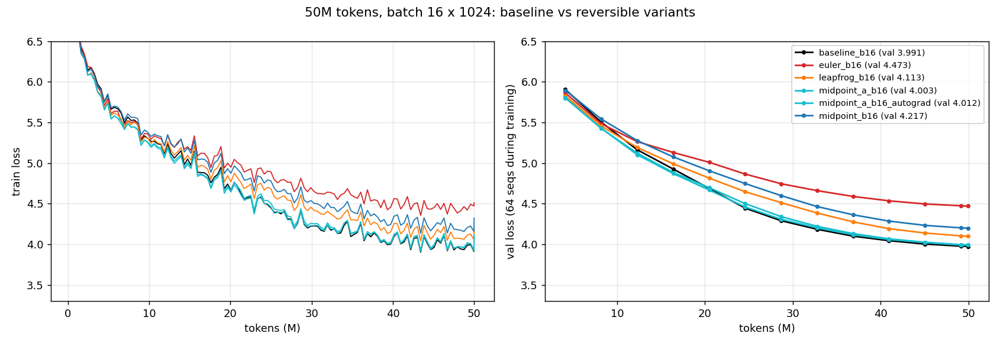
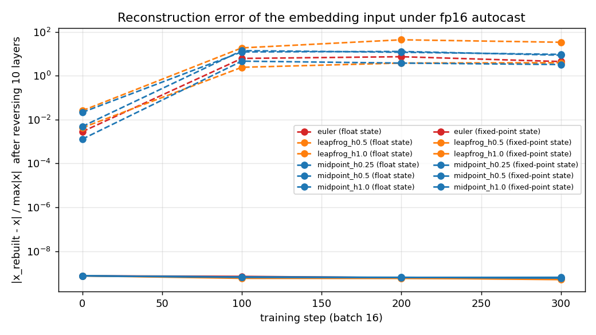
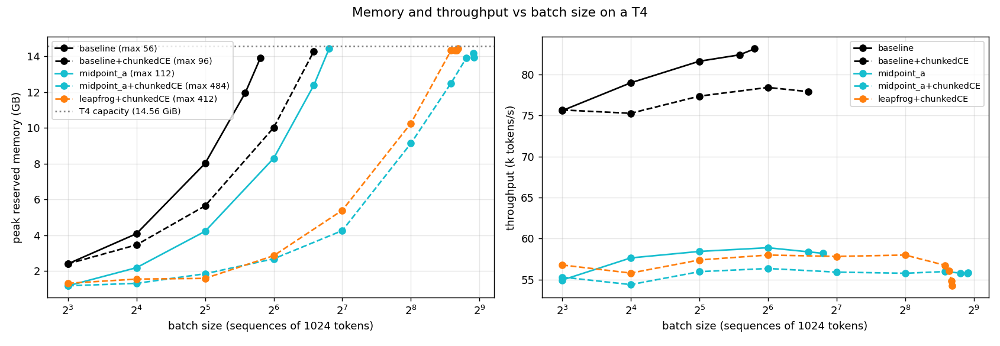
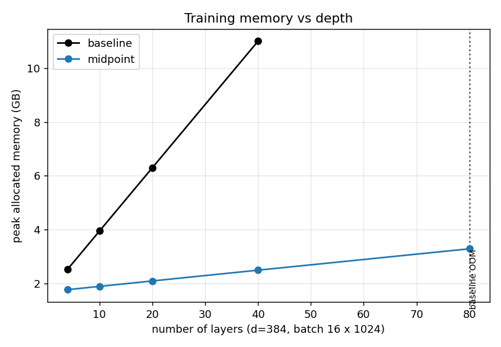

# Session XIII — Reversible LLM training on a single T4

> Assignment: train a ~20M LLM for 50M tokens at a fixed batch size; train again with reversibility
> (report which variant works: midpoint, Euler, ...); train again with reversibility at the maximum
> batch size. Report final loss, speed (tokens/s), peak memory and other findings.

Everything here ran on one **Tesla T4 (15 GB, fp16 tensor cores, no bf16)**, conda env `erav5`
(PyTorch 2.14 + CUDA 12.6).

---

## TL;DR

| Run (50M tokens each) | batch × seq | val loss | tokens/s | peak mem (alloc / reserved) |
|---|---|---:|---:|---:|
| **Baseline** (standard residual) | 16 × 1024 | **3.991** | **77.3k** | 3.95 / 4.08 GB |
| Reversible **Midpoint-a** (paper eq. 15) | 16 × 1024 | **4.003** | 55.5k | **1.85** / 2.18 GB |
| Reversible **Leapfrog** (eq. 6) | 16 × 1024 | 4.113 | 57.1k | 1.92 / 2.25 GB |
| Reversible **Midpoint** (eq. 4) | 16 × 1024 | 4.217 | 57.8k | 1.92 / 2.25 GB |
| Reversible **Euler** (Hamiltonian / symplectic Euler, eqs. 8–9) | 16 × 1024 | 4.473 | 59.0k | 1.92 / 2.25 GB |
| Reversible Leapfrog, **max batch** | **384** × 1024 | 6.331 | 56.8k | 13.88 / 14.37 GB |
| Reversible Midpoint-a, **max batch** | **456** × 1024 | 6.382 | 55.4k | 13.07 / 14.35 GB |
| Baseline, max batch (for reference) | 48 × 1024 | 4.109 | 79.7k | 11.25 / 11.96 GB |

- **Which variant worked:** the **Midpoint family**. Midpoint-a (the paper's main "midpoint with θ/a")
  nearly matches the baseline (+0.012 loss). Among variants that are *exactly* reversible in fp16,
  **Leapfrog** is best (+0.12). Plain Midpoint beats Euler (+0.23 vs +0.48), consistent with the lecture.
- **Memory:** reversibility halves peak memory at batch 16 and removes ~90% of layer activations.
  Max batch goes from **56 → 412–484** (7–8.6×) once the cross-entropy is chunked too.
- **Speed:** reversible training is **25–28% slower** per token (extra forward recompute in backward),
  and a bigger batch does **not** buy throughput back on a T4 at this model size.
- **Loss at max batch is much worse** (6.3 vs 4.0) because 50M tokens at 400k tokens/step is only
  ~110–127 optimizer steps. Max batch is a memory capability, not a free win.
- **Biggest practical finding:** naive reversal under fp16 **silently breaks** (reconstructed inputs
  off by 2–43× their own size after 100 steps). I fixed it with **fixed-point (int64) hidden states**,
  which makes reversal bit-exact.



---

## Setup

| | |
|---|---|
| Data | FineWeb-Edu `sample-10BT`, streamed; 52M train tokens + 1M val tokens (`prepare_data.py`) |
| Tokenizer | byte-level BPE, 8192 vocab trained on the same stream (3.88 chars/token) |
| Model | GPT, 10 layers, d=384, 6 heads, context 1024, GELU MLP 4×, pre-LN, tied embeddings, learned positions |
| Params | **21.25M** total (17.7M non-embedding). Same parameters for every variant |
| Optimizer | AdamW (0.9, 0.95), lr 1.5e-3, 5% warmup, cosine to 10%, grad clip 1.0 |
| Regularisation | weight decay 0 and dropout 0 for all runs (the lecture's reversibility constraints, applied to baseline too for fairness) |
| Precision | fp16 autocast + GradScaler (T4 has no bf16); residual stream kept in fp32 |
| Data order | identical shuffled order of non-overlapping 1024-token windows for every run; each run sees 50M tokens once |
| Metrics | final train loss = mean of last 10% of logged steps; val loss = full 1M-token val split; tokens/s = steady state after step 50, excluding eval; memory = `torch.cuda.max_memory_allocated/reserved` |

The model is small enough that I did not `torch.compile` it (fair comparison: all runs eager).

---

## Reversible variants (what I implemented)

Every variant uses the same block $f(p) = \mathrm{Attn}(\mathrm{LN_1}\, p) + \mathrm{MLP}(\mathrm{LN_2}(p + \mathrm{Attn}(\mathrm{LN_1}\, p)))$;
only the rule that carries state across depth changes (from *Reversing Large Language Models for
Efficient Training and Fine-Tuning*, arXiv 2512.02056, discussed in class):

| name | forward | inverse used in backward |
|---|---|---|
| baseline | $p_{l+1} = p_l + f(p_l)$ | not invertible, activations stored |
| midpoint | $p_{l+1} = p_{l-1} + 2h\,f(p_l)$ | $p_{l-1} = p_{l+1} - 2h\,f(p_l)$ |
| midpoint_a | $p_{l+1} = a\,p_{l-1} + (1-a)\,p_l + h\,f(p_l)$, with $a = \pm 1 + U(-\tfrac{1}{2},\tfrac{1}{2})$ fixed per layer | $p_{l-1} = \bigl(p_{l+1} - (1-a)\,p_l - h\,f(p_l)\bigr)/a$ |
| leapfrog | $p_{l+1} = 2p_l - p_{l-1} + h^2 f(p_l)$ | $p_{l-1} = 2p_l - p_{l+1} + h^2 f(p_l)$ |
| euler | $q_{l+1} = q_l + \mathrm{Attn}(\mathrm{LN_1}\, p_l)$, then $p_{l+1} = p_l + \mathrm{MLP}(\mathrm{LN_2}\, q_{l+1})$ | undo MLP step, then attention step |

`model.py::RevStack` is a custom `autograd.Function`: the forward runs all layers under `no_grad` and
keeps only the last two states; the backward walks layers in reverse, recomputes $f$ for one layer
with grad enabled, back-propagates through it, and reconstructs the previous state from the inverse
formula. Peak activation memory is therefore one layer, not ten.

`test_reversible.py` verifies that this backward equals plain autograd through the same equations
(relative gradient error ~2e-6 in fp32 for all four variants).

---

## Finding 1 — fp16 breaks naive reversal; fixed-point state fixes it

The first sweep used fp32 states with fp16 matmuls. Gradients looked fine at initialization, but the
**embedding input reconstructed after reversing 10 layers was wrong by 2×–43× its own magnitude after
only 100 steps** (dashed lines below), even though the loss still went down.

Cause: the backward recomputes $f(p_l)$ from a reconstructed $p_l$ that differs from the forward
one by ~1 fp32 ulp. After LayerNorm the fp16 cast rounds a few elements differently, which injects
an fp16-ulp error each layer, and the midpoint/leapfrog recurrences amplify it backward as weights grow.
The early layers and the embeddings then receive gradients computed at the wrong input.

Fix (`model.py`, `exact=True` default): store the hidden states as **int64 fixed point (32 fractional
bits)** and quantise every layer's increment before adding it. Integer add/subtract is exact and the
recompute of $f$ is bit-identical (checked), so the backward rebuilds the forward states **exactly**.
The error stays at the ~6e-10 input-quantisation level for the whole run (solid lines). The
quantise/add ops are fused with `torch.compile`, so exactness costs no throughput (57–59k tokens/s
exact vs 55–60k float).



Gradient quality under fp16 against an fp32 ground truth (`artifacts/grad_check.json`,
"grown" = weights scaled 4× to mimic a partly trained model):

| variant | plain fp16 autograd | reversible, float state | reversible, fixed-point state |
|---|---:|---:|---:|
| midpoint (grown) | 7.3% | 21.1% | **7.3%** |
| leapfrog (grown) | 5.8% | 25.3% | **5.8%** |
| euler (grown) | 8.0% | 29.6% | **7.9%** |
| midpoint_a (grown) | 7.2% | 15.2% | 15.2% (cannot be made exact) |

Midpoint-a multiplies by a non-integer $a$, which cannot be inverted exactly in integers, so it
stays on float state and is *approximately* reversible. A control run with ordinary autograd (exact
gradients, full activation memory) reached val 4.012 vs 4.003 for the reversible run, so in this run
its approximate gradients cost nothing measurable.

---

## Finding 2 — which variant works (fixed batch 16)

Step size $h$ was picked with 5M-token runs (`sweep_h.sh`, `figures/h_sweep.png`); $h = 1.0$ won for
midpoint, midpoint_a and leapfrog (it was the largest value tried).

| variant (50M tokens, batch 16) | exact reversal? | val loss | Δ vs baseline |
|---|---|---:|---:|
| baseline | — | 3.991 | — |
| **midpoint_a**, h=1 | no (float state) | **4.003** | **+0.012** |
| midpoint_a, h=1, plain autograd (control) | n/a | 4.012 | +0.021 |
| **leapfrog**, h=1 | yes | **4.113** | +0.122 |
| midpoint, h=1 | yes | 4.217 | +0.226 |
| euler (Hamiltonian) | yes | 4.473 | +0.482 |

Why the ranking makes sense:

- **Plain midpoint** decouples into two interleaved streams: $p_L = x + 2h \sum_{\text{odd } l} f_l(\cdot)$.
  Only half the layers write directly into the output, so a 10-layer midpoint net behaves like two
  5-layer streams. It matched the baseline at 4M tokens and then fell steadily behind.
- **Leapfrog** accumulates a "velocity", so every layer's update reaches the output. Better than midpoint.
- **Midpoint-a** mixes the two streams through $(1-a)\,p_l$, and in expectation it is a forward-Euler /
  standard residual step (paper eq. 18). That is why it tracks the baseline.
- **Euler / Hamiltonian** lets attention read only the MLP stream and vice versa. At this small depth
  that loses the most expressiveness.

**My answer to "which variant worked":** Midpoint-a for quality; Leapfrog if exact fp16 reversibility
is required. Plain Midpoint > Euler, as stated in the lecture.

Caveat: the 5M-token sweep over-predicted plain midpoint (it beat the baseline at 5M and lost at 50M).
Short sweeps with a complete cosine decay reward early speed and don't predict the final ranking.

---

## Finding 3 — memory: activations disappear, the LM head becomes the wall



| config (seq 1024) | max batch on T4 | vs baseline |
|---|---:|---:|
| baseline | 56 | 1× |
| baseline + chunked cross-entropy | 96 | 1.7× |
| midpoint_a (reversible) | 112 | 2× |
| **midpoint_a + chunked CE** | **484** | **8.6×** |
| **leapfrog + chunked CE** (int64 state) | **412** | **7.4×** |

- At batch 16 the baseline holds ~2.3 GB of layer activations; the reversible model holds ~0.2 GB,
  roughly a **10× activation reduction**, in line with the paper's ~10× max-batch gain.
- After reversibility, the largest tensor is the **logits** (tokens × 8192 vocab, in fp16 + fp32 + grad).
  Without chunking, reversible max batch is only 2×. Computing the head + loss in checkpointed
  chunks of 8 sequences (`--ce_chunks`) removes that wall.
- Leapfrog's int64 state costs 8 bytes/element vs 4, hence 412 vs 484.
- At the edge, a batch that passed a 4-step probe still hit fragmentation OOM mid-run (2.3 GB reserved
  but unusable). `PYTORCH_CUDA_ALLOC_CONF=expandable_segments:True` fixed it.

Memory vs depth (batch 16, d=384): the baseline grows ~0.24 GB/layer and OOMs at 80 layers; the
reversible model grows ~0.02 GB/layer, which is just weights + Adam state (16 B/param).



---

## Finding 4 — speed and the max-batch run

- **Same batch:** reversible = 55–59k tokens/s vs 77k baseline, i.e. **25–28% slower**, matching the
  lecture's "30–40% slower". Each layer's forward runs twice (forward + reconstruction).
- **Bigger batch does not raise throughput here.** Baseline goes 75k → 83k tokens/s from batch 8 to 56;
  reversible stays flat at ~55–59k from 8 to 484. At 16k tokens/step the T4 is already compute-bound, so
  there is no idle hardware for the extra memory to fill. The paper's throughput gains come from deep,
  large models where the baseline can only fit a tiny batch.
- **Loss at max batch is far worse at a fixed token budget:**

| run | steps | lr | val loss |
|---|---:|---:|---:|
| leapfrog batch 16 | 3051 | 1.5e-3 | 4.113 |
| leapfrog batch 384 | 127 | 6e-3 (√-scaled) | 6.331 |
| leapfrog batch 384 | 127 | 1.2e-2 | 6.474 |
| midpoint_a batch 456 | 107 | 6e-3 | 6.382 |
| baseline batch 48 | 1017 | 2.6e-3 | 4.109 (vs 3.991 at batch 16) |

  The runs are stable (no divergence, smooth grad norms), but ~110–127 optimizer steps are not enough
  for a 21M model. Doubling the LR made it worse, so the limit is the number of steps, not the LR. Even
  the baseline loses 0.12 going from batch 16 to 48. For this model size the useful batch is small.

**What the extra memory is really for:** longer context, deeper/larger models, or fewer GPUs for the
same model — not a bigger batch at a fixed token budget. That matches the lecture's framing: reversibility
lets one B200 node hold what would otherwise need tensor/pipeline/context parallelism.

---

## Cost (rough)

Wall-clock for 50M tokens: baseline 10.8 min, reversible 14.2–15.0 min. At roughly \$0.5/hour for a
cloud T4, that is about \$0.09 vs \$0.12 per run: reversibility trades ~35% more compute time for ~50%
less memory at the same batch.

---

## Files

| file | purpose |
|---|---|
| `Session_XIII_Reversible_LLM.ipynb` | notebook to open and run (submit this) |
| `prepare_data.py` | stream FineWeb-Edu, train 8k BPE, write `data/train.bin`, `data/val.bin` |
| `model.py` | GPT + all reversible variants, `RevStack` memory-efficient backward, fixed-point state, chunked CE |
| `train.py` | training loop, logging, `--probe` mode for memory/speed probes |
| `test_reversible.py` | gradient/reconstruction checks (float vs fixed-point) → `artifacts/grad_check.json` |
| `sweep_h.sh` | 5M-token step-size sweep |
| `find_max_batch.py` | doubling + binary search for max batch → `artifacts/batch_sweep.json` |
| `depth_probe.py` | memory vs number of layers → `artifacts/depth_probe.json` |
| `pipeline.py`, `run_max.sh` | orchestration of the full runs and max-batch runs |
| `make_report.py` | figures in `figures/` and `artifacts/summary.md` |
| `runs/<name>/` | `log.jsonl` (per-step loss, val, tok/s, recon error) and `summary.json` per run |
| `runs/sweepfloat_*` | the original float-state sweep, kept as evidence for Finding 1 |

Reproduce:

```bash
conda activate erav5
cd Session-XIII
python prepare_data.py          # only if data/ is missing
jupyter notebook Session_XIII_Reversible_LLM.ipynb
```

The notebook loads the finished runs and re-runs the gradient check. To repeat the
50M-token training from scratch:

```bash
python test_reversible.py
python train.py --mode baseline --batch 16 --name baseline_b16
./sweep_h.sh && python pipeline.py && ./run_max.sh
python make_report.py
python build_notebook.py        # refresh the notebook source, then re-execute it
```
